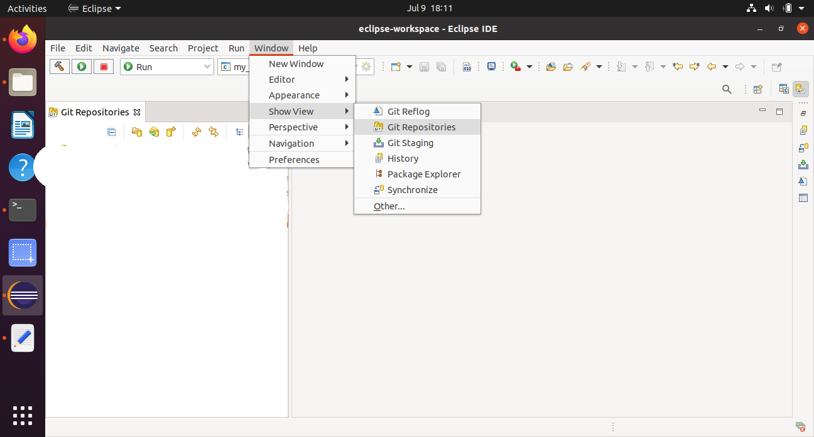
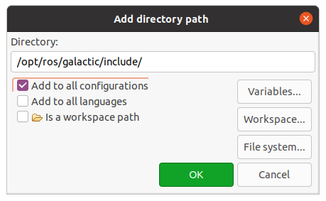

#Building ROS 2 C++ Package with C code


## Info

   
The intention is to write a tutorial to build ROS 2 packages for many,many e.g. raspberry-pi
hats, because they mostly include c code for initial testing.
   
   
## Source the setup files

You will need to run this command on every new shell you open to have access to the ROS 2 commands, like so:

```
source /opt/ros/{DISTRO}/setup.bash
```


The exact command depends on where you installed ROS 2.
If you're having problems, ensure the file path leads to your installation.
    
## Create a new directory

Best practice is to create a new directory for every new workspace.
The name doesn’t matter, but it is helpful to have it indicate the purpose of the workspace.
Let’s choose the directory name ``dev_ws``, for “development workspace”:


```
mkdir -p ~/dev_ws/src
cd ~/dev_ws/src
```


Another best practice is to put any packages in your workspace into the ``src`` directory.
The above code creates a ``src`` directory inside ``dev_ws`` and then navigates into it.


  
## Create a package

First, :ref:`source your ROS 2 installation <ConfigROS2>`.

Let’s use the workspace you created in the :ref:`previous tutorial <new-directory>`, ``dev_ws``, for your new package.`

Make sure you are in the ``src`` folder before running the package creation command.

```
cd ~/dev_ws/src
```


The command syntax for creating a new package in ROS 2 is:

```
ros2 pkg create --build-type ament_cmake <package_name>
```

        
Create your package my_package, and create a git repository from it.
If we create a git repo from it, we can easily use it in eclipse, also
we got directly a history of our changes.


   
## Start eclipse and select a eclipse-workspace.


   
Open the Git View




## Add the my_package git repository you created to the git view.


   
Select the my_package you just created before.


   
Now you got your ROS 2 package in eclipse git view.


   
## To edit the files in this git repository, we import it.


   


You can now see, edit all files in project explorer.


   
## To get all C++ includes resolved, convert the project to C++ to add C++ nature.


   


   
Now you can see the added includes in the project explorer view.


   
   
## Adding ROS 2 include path

The C++ nature also allows you now to set include path. Right-click on your
project in project explorer and select "Properties".


   



## Adding colcon as Builder

To build the project with right-click on  project and select "Build Project", we
setup a builder. Right-click on your project and select "Properties".


Click "Add" and use Program.
  


   
Note that the environment variables like AMENT_PREFIX_PATH getting updated if you
source a setup.bash or setup.sh file. You get these env variables with the "env" command
on console after sourcing your setup files. You need to perhaps also update this variable,
when you source a new setup file.
   

   
   
Now it should look like this.


## Add source code to project

We create a file in the src/ directory, which we name "publisher_member_function.cpp", just
like in this tutorial

:ref:`Write the publisher node <Write the publisher node>`.

https://docs.ros.org/en/galactic/Tutorials/Writing-A-Simple-Cpp-Publisher-And-Subscriber.html#write-the-publisher-node


Then we copy the source code from https://raw.githubusercontent.com/ros2/examples/master/rclcpp/topics/minimal_publisher/member_function.cpp
into this newly created file. We could build that now with right-click "Build Project".


## Clone a git repository from a e.g. pi-hat

For this tutorial we see on the wiki-page https://www.waveshare.com/wiki/High-Precision_AD/DA_Board that
there is a github repository with the code.

https://github.com/waveshare/High-Precision-AD-DA-Board.git


   


After that, import the git repository from the git-view into project explorer. Same as above.
Right-click on git-view-repo and select import. You now got two projects in your project explorer.


## Copy the needed files from a e.g. pi-hat project

The files to use the ADC are here. ADS1256.c , ADS1256.h, DEV_Config.c,
DEV_Config.h, Debug.h.


   
   
We could create another package and build a library, then use this library in your project.
To keep the package as simple as it gets, copy the needed files into your project. 


   
   
## Making code changes
   
When looking at the main.c file from the High-Precision-AD-DA-Board project, we see that only
DEV_ModuleInit(); ADS1256_init() and ADS1256_GetAll(ADC) is used to get the ADC values.


   
   
So, open the publish_member_function.cpp file and fill in this:

```

   // Copyright 2016 Open Source Robotics Foundation, Inc.
   ///////////////////////////////////////////////////////
   // Licensed under the Apache License, Version 2.0 (the "License");
   // you may not use this file except in compliance with the License.
   // You may obtain a copy of the License at
   //////////////////////////////////////////
   //     http://www.apache.org/licenses/LICENSE-2.0
   /////////////////////////////////////////////////
   // Unless required by applicable law or agreed to in writing, software
   // distributed under the License is distributed on an "AS IS" BASIS,
   // WITHOUT WARRANTIES OR CONDITIONS OF ANY KIND, either express or implied.
   // See the License for the specific language governing permissions and
   // limitations under the License.
   
   #include <chrono>
   #include <functional>
   #include <memory>
   #include <string>
   
   #include "rclcpp/rclcpp.hpp"
   #include "std_msgs/msg/string.hpp"
   #include "std_msgs/msg/float32_multi_array.hpp"
   #include "std_msgs/msg/multi_array_dimension.hpp"
   
   extern "C" {
   #include "../include/my_package/ADS1256.h"
   }
   
   
   using namespace std::chrono_literals;
   
   /* This example creates a subclass of Node and uses std::bind() to register a
    * member function as a callback from the timer. */
   
   class MinimalPublisher : public rclcpp::Node
   {
   public:
     MinimalPublisher()
     : Node("minimal_publisher"), count_(0)
     {
        ADS1256_init();
        DEV_ModuleInit();
   //   DEV_ModuleExit();
   
       publisher_ = this->create_publisher<std_msgs::msg::Float32MultiArray>("topic", 10);
       timer_ = this->create_wall_timer(
         500ms, std::bind(&MinimalPublisher::timer_callback, this));
     }
   
   private:
     void timer_callback()
     {
        ADS1256_GetAll(ADC);
   
        auto message = std_msgs::msg::Float32MultiArray();
        message.layout.dim.push_back(std_msgs::msg::MultiArrayDimension());
        message.layout.dim[0].size = 8;
        message.layout.dim[0].stride = 1;
        message.layout.dim[0].label = "adc";
        message.layout.data_offset = 0;

        for(i = 0; i < 8; i++) {
           message.data.push_back(ADC[i]*5.0/0x7fffff);
     }

    RCLCPP_INFO(this->get_logger(), "Publishing: '%f'", *message.data.data());
       publisher_->publish(message);
     }
     rclcpp::TimerBase::SharedPtr timer_;
     rclcpp::Publisher<std_msgs::msg::Float32MultiArray>::SharedPtr publisher_;
     size_t count_;
     uint32_t ADC[8], i;
   };
   
   int main(int argc, char * argv[])
   {
     rclcpp::init(argc, argv);
     rclcpp::spin(std::make_shared<MinimalPublisher>());
     rclcpp::shutdown();
     return 0;
   }
```

If you include C code, the e.g. function-names should not be name mangled, what C++ is doing.
To prevent that, use

```

   extern "C" {
   #include "../include/my_package/ADS1256.h"
   }
```

Then put in simply the code from the main.c file as you can see.

## Edit package.xml

Now edit package.xml file


## Edit CMakeLists.txt

Now edit the CMakeLists.txt file.

```

   cmake_minimum_required(VERSION 3.8)
   project(my_package)
   
   if(CMAKE_COMPILER_IS_GNUCXX OR CMAKE_CXX_COMPILER_ID MATCHES "Clang")
     add_compile_options(-Wall -Wextra -Wpedantic -lpthread -lm -lwiringPi)
   endif()
   
   # find dependencies
   find_package(ament_cmake REQUIRED)
   find_package(rclcpp REQUIRED)
   
   add_executable(my_node src/publisher_member_function.cpp
               src/ADS1256.c
               src/DEV_Config.c)
               
   ament_target_dependencies(my_node rclcpp std_msgs)
   
   target_link_libraries(my_node wiringPi)
   
   target_include_directories(my_node PRIVATE
     $<BUILD_INTERFACE:${CMAKE_CURRENT_SOURCE_DIR}/include>
     $<INSTALL_INTERFACE:include>)
   
   if(BUILD_TESTING)
     find_package(ament_lint_auto REQUIRED)
     # the following line skips the linter which checks for copyrights
     # uncomment the line when a copyright and license is not present in all source files
     #set(ament_cmake_copyright_FOUND TRUE)
     # the following line skips cpplint (only works in a git repo)
     # uncomment the line when this package is not in a git repo
     #set(ament_cmake_cpplint_FOUND TRUE)
     ament_lint_auto_find_test_dependencies()
   endif()
   
   install(TARGETS
     my_node
     DESTINATION lib/${PROJECT_NAME})
   
   ament_package()
```


The most interresting part is


```
   if(CMAKE_COMPILER_IS_GNUCXX OR CMAKE_CXX_COMPILER_ID MATCHES "Clang")
     add_compile_options(-Wall -Wextra -Wpedantic -lpthread -lm -lwiringPi)
   endif()
   
   target_link_libraries(my_node wiringPi)
```


The DESTINATION must be inside lib/  or "ros2 run my_package my_node" will not find my_node.

Perhaps also interresting, on ubuntu-20.04 (also on rpi4 image) you can install

```
sudo apt install libwiringpi-dev
```

## Edit include path inside added files
  
The next thing we need todo, we need to change the #include paths inside the new files.
Like this.


   
## Build the package

 
Now we can build it with right-click on project and "Build Project" or "colcon build" on cmdline. Source setup files
if you use cmdline.

## Run the ROS 2 Node

To run the node source the setup.sh file in dev_ws/install directory. "source /home/ros2/dev_ws/install/setup.sh". Then run

```
"ros2 run my_package my_node
```

 and look at the topic in another console (source all setup files) type 
 
 ```
 ros2 topic echo topic
 ```


## Plot Node output with rqt

In console run 

```
rqt
```

Then in rqt select "Plugins->Visualization->Plot".  Then in the Plot window, type "/topic/data[0]" and "/topic/data[1]"
and so on, for the 8 data values.


