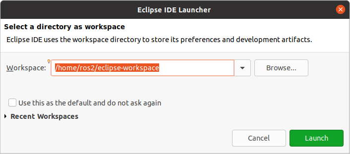
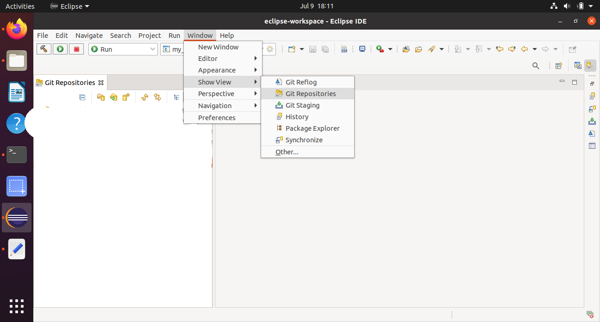
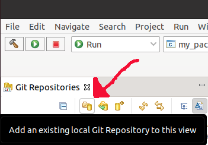

# Building ROS 2 Package with tensorflow mediapipe

   
   
Implementing Tensorflow mediapipe (https://github.com/google/mediapipe) and 
using Hands (https://google.github.io/mediapipe/solutions/hands), for tracking multiple hands.
Node publishs custom Hand.msg with x,y,z coordinates of 21 3D hand-knuckle coordinates per hand. Also a 
image stream with the camera-image overlayed with the tracked hands on 
topic /hand_image.

For rviz2 we write a urdf package with floating sphere links to display the 
hand and using the mediapipe node to control it. 
   
  
## Install some packages

pip3 install opencv-python
pip3 install mediapipe

 
## Source the setup files

You will need to run this command on every new shell you open to have access to the ROS 2 commands, like so:

```
source /opt/ros/{DISTRO}/setup.bash
```

  
The exact command depends on where you installed ROS 2.
If you're having problems, ensure the file path leads to your installation.
    
## Create a package

First, :ref:`source your ROS 2 installation <ConfigROS2>`.

Let’s use the workspace you created in the :ref:`previous tutorial <new-directory>`, ``dev_ws``, for your new package.`

Make sure you are in the ``src`` folder before running the package creation command.

```
cd ~/dev_ws/src
```

 

The command syntax for creating a new package in ROS 2 is:

```
ros2 pkg create --build-type ament_python --node-name mediapipe-hands mediapipe-hands
```


Then 

```
cd mediapipe-hands
```

```
git init;git add .
```

## Start eclipse and select a eclipse-workspace.



   
Open the Git View




## Add the mediapipe-hands git repository you created to the git view.




   

