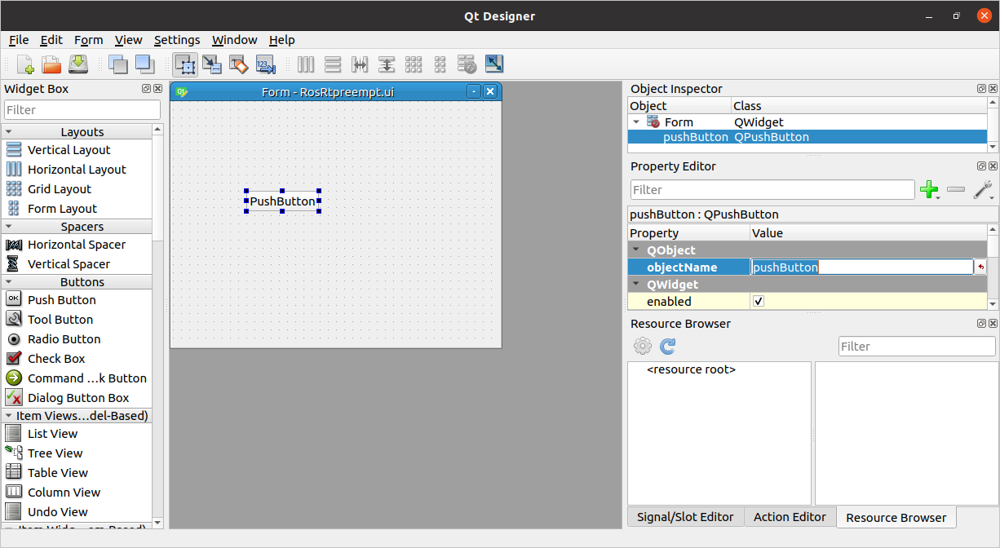
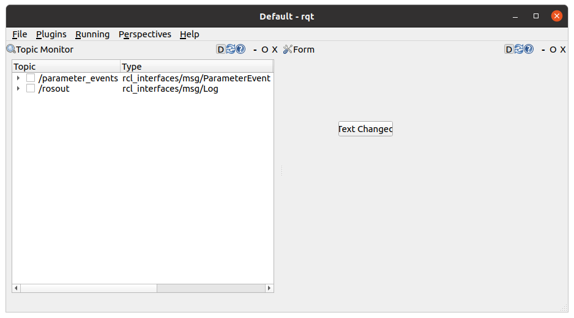

# Building ROS 2 Rqt Plugin


## Info

```
rqt --list-plugins
```

## Create Package

```
ros2 pkg create --build-type ament_python rqt_rt_preempt
```

## Create local git repo

```
cd rqt_rt_preempt/
git init
git add .
```

## Add git repo to eclipse and import as project

look at other tutorials

## Edit package.xml

```
<?xml version="1.0"?>
<?xml-model href="http://download.ros.org/schema/package_format3.xsd" schematypens="http://www.w3.org/2001/XMLSchema"?>
<package format="3">
  <name>rqt_rt_preempt</name>
  <version>0.0.0</version>
  <description>TODO: Package description</description>
  <maintainer email="hey@ho.de">ros2</maintainer>
  <license>TODO: License declaration</license>

  <test_depend>ament_copyright</test_depend>
  <test_depend>ament_flake8</test_depend>
  <test_depend>ament_pep257</test_depend>
  <test_depend>python3-pytest</test_depend>
  
  <exec_depend version_gte="0.2.19">python_qt_binding</exec_depend>
  <exec_depend>rqt_gui</exec_depend>
  <exec_depend>rqt_gui_py</exec_depend>
  <exec_depend>rqt_py_common</exec_depend>
  
   <export>
    <build_type>ament_python</build_type>
    <rqt_gui plugin="${prefix}/plugin.xml"/>
  </export>
</package>

```

## Edit setup.py

error: package directory 'rqt_rt_preempt/rqt_rt_preempt' does not exist, when using

```
from setuptools import setup

package_name = 'rqt_rt_preempt'

setup(
    name=package_name,
    version='0.0.0',
    # package_dir={'': 'rqt_rt_preempt'},
    packages=[package_name],
    data_files=[
        ('share/ament_index/resource_index/packages',
            ['resource/' + package_name]),
        ('share/' + package_name, ['package.xml']),
        ('share/' + package_name + '/resource', ['resource/RosRtpreempt.ui']),
        ('share/' + package_name, ['plugin.xml']),
    ],
    install_requires=['setuptools'],
    zip_safe=True,
    maintainer='ros2',
    maintainer_email='ho@mail.de',
    description='TODO: Package description',
    license='TODO: License declaration',
    tests_require=['pytest'],
    entry_points={
        'console_scripts': [
            'rqt_rt_preempt = rqt_rt_preempt.main:main',
        ],
    },
)

```


## Create plugin.xml file

Enter into it

```
<library path="./">
  <class name="RosRtpreempt" type="rqt_rt_preempt.ros_rt_preempt.RosRtpreempt" base_class_type="rqt_gui_py::Plugin">
    <description>
      A Python GUI plugin to configure rt-preempt.
    </description>
    <qtgui>
      <group>
        <label>Miscellaneous Tools</label>
        <icon type="theme">folder</icon>
        <statustip>Plugins related to Miscellaneous Tools.</statustip>
      </group>
      <label>Config rt-preempt</label>
      <icon type="theme">preferences-system-network</icon>
      <statustip>A Python GUI plugin for visualizing the ROS computation graph.</statustip>
    </qtgui>
  </class>
</library>

```

## Create a main.py file

We create it inside the directory "/home/ros2/dev_ws/rqt_rt_preempt/rqt_rt_preempt" and put

```
#!/usr/bin/env python3

import sys

from rqt_gui.main import Main

def main():
    main = Main()
    sys.exit(main.main(sys.argv, standalone='rqt_rt_preempt.ros_rt_preempt.RosRtpreempt'))


if __name__ == '__main__':
    main()
```


## Create RosRtpreempt.ui file

Create the file RosRtpreempt.ui inside resources folder.

Then automatically Qt-designer opens up and prints some errors. We click on New form.
Then select Widget. Then we save it and select the previously created RosRtpreempt.ui file.

If we close Qt-designer and then click in eclipse on the RosRtpreempt.ui file, it opens in Qt-designer without errors.


## Create ros_rt_preempt.py

Create the file rqt_rt_preempt/ros_rt_preempt.py and put this into

```
from rqt_gui_py.plugin import Plugin

from .rt_preempt_widget import RtpreemptWidget
    
    
class RosRtpreempt(Plugin):


    def __init__(self, context):
        super(RosRtpreempt, self).__init__(context)
        self._node = context.node
        self._logger = self._node.get_logger().get_child('rqt_rt_preempt.ros_rt_preempt.RosRtpreempt')
        
        super(RosRtpreempt, self).__init__(context)
        self.setObjectName('RosRtpreempt')

        self._widget = RtpreemptWidget(context.node, self)

        self._widget.start()
        if context.serial_number() > 1:
            self._widget.setWindowTitle(
                self._widget.windowTitle() + (' (%d)' % context.serial_number()))
        context.add_widget(self._widget)

```

## Create rt_preempt_widget.py

Create rqt_rt_preempt/rt_preempt_widget.py

```
#!/usr/bin/env python

from __future__ import division

import itertools
import os

from ament_index_python import get_resource
from python_qt_binding import loadUi
from python_qt_binding.QtCore import Qt, QTimer, qWarning, Slot
from python_qt_binding.QtGui import QIcon
from python_qt_binding.QtWidgets import QHeaderView, QMenu, QTreeWidgetItem, QWidget
from rqt_py_common.message_helpers import get_message_class


class RtpreemptWidget(QWidget):

    def __init__(self, node, plugin=None):

        super(RtpreemptWidget, self).__init__()

        self._node = node

        _, package_path = get_resource('packages', 'rqt_rt_preempt')
        ui_file = os.path.join(package_path, 'share', 'rqt_rt_preempt', 'resource', 'RosRtpreempt.ui')
        loadUi(ui_file, self)
        self._plugin = plugin


    def start(self):
        pass

    def shutdown_plugin(self):
        pass


```

## Build it , run it

Build it as always.

```
colcon build
```

Run it with

```
rqt
```

or if it cannot find it at first run, try

```
rqt -s rqt_rt_preempt --force-discover
```

Now under "Plugins"  "Miscellaneous Tools" it is.


## Adding a Qt pushbutton and change text

Double-click the RosRtpreempt.ui file in eclipse and the Qt-designer opens. Setup a pushbutton
and set the objectName to "pushButton".




In the rt_preempt_widget.py file add 

```
self.pushButton.setText('Text Changed')
```

Here the full file content.

```
#!/usr/bin/env python

from __future__ import division

import itertools
import os

from ament_index_python import get_resource
from python_qt_binding import loadUi
from python_qt_binding.QtCore import Qt, QTimer, qWarning, Slot
from python_qt_binding.QtGui import QIcon
from python_qt_binding.QtWidgets import QHeaderView, QMenu, QTreeWidgetItem, QWidget
from rqt_py_common.message_helpers import get_message_class


class RtpreemptWidget(QWidget):

    def __init__(self, node, plugin=None):

        super(RtpreemptWidget, self).__init__()

        self._node = node

        _, package_path = get_resource('packages', 'rqt_rt_preempt')
        ui_file = os.path.join(package_path, 'share', 'rqt_rt_preempt', 'resource', 'RosRtpreempt.ui')
        loadUi(ui_file, self)
         
        self._plugin = plugin
        
        self.pushButton.setText('Text Changed')

    def start(self):
        pass

    def shutdown_plugin(self):
        pass
```


## Build it and run it.

```
colcon build
rqt
```

We see our button, and the changed Text.




## Connect pushButton clicked signal to own method

Add in the file rt_preempt_widget.py the following

```
self.pushButton.clicked.connect(self.pushButtonPressed)
        
        
def pushButtonPressed(self):
     self.pushButton.setText('Text Changed')
```

Here is the full file content.

```
#!/usr/bin/env python

from __future__ import division

import itertools
import os

from ament_index_python import get_resource
from python_qt_binding import loadUi
from python_qt_binding.QtCore import Qt, QTimer, qWarning, Slot
from python_qt_binding.QtGui import QIcon
from python_qt_binding.QtWidgets import QHeaderView, QMenu, QTreeWidgetItem, QWidget
from rqt_py_common.message_helpers import get_message_class


class RtpreemptWidget(QWidget):

    def __init__(self, node, plugin=None):

        super(RtpreemptWidget, self).__init__()

        self._node = node

        _, package_path = get_resource('packages', 'rqt_rt_preempt')
        ui_file = os.path.join(package_path, 'share', 'rqt_rt_preempt', 'resource', 'RosRtpreempt.ui')
        loadUi(ui_file, self)
         
        self._plugin = plugin
        
        self.pushButton.clicked.connect(self.pushButtonPressed)
        
        
    def pushButtonPressed(self):
        self.pushButton.setText('Text Changed')

    def start(self):
        pass

    def shutdown_plugin(self):
        pass
```

## Build it, run it

```
colcon build
rqt
```

Now click on the button, then the text changes.


