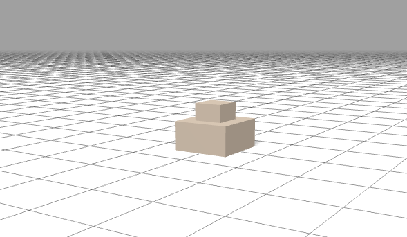
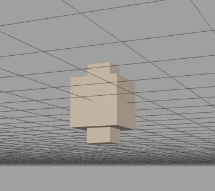
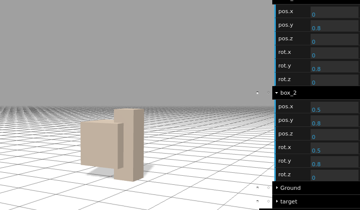
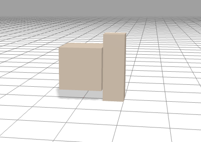
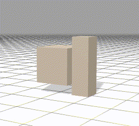
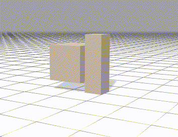
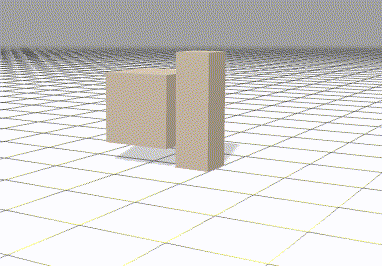
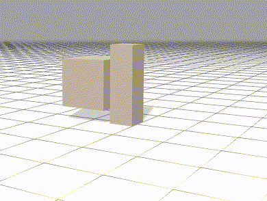

# Building google brax environment


## Clone google brax github repo

```
git clone https://github.com/google/brax.git
```

## Create env file

Goto brax/brax/envs/ and create e.g. testenv.py

## Fill in some skeleton code

To get it simply run with the provided training.ipynb, we need some minimum code.

Plus, we add two boxes.

```
from typing import Tuple

import dataclasses
import jax
import jax.numpy as jnp
import brax
from brax.envs import env
from brax.physics import math
from brax.physics.base import take
from brax.tests import debug_outputs

from google.protobuf import text_format


class SkeletonEnv(env.Env):
  """Trains a reacher arm to touch a sequence of random targets."""

  def __init__(self, **kwargs):
    config = text_format.Parse(_SYSTEM_CONFIG, brax.Config())
    super().__init__(config, **kwargs)
    self.target_idx = self.sys.body_idx['target']
    #self.target_idx = self.sys.body_idx['servo_bracket_fp04_f2']

  def reset(self, rng: jnp.ndarray) -> env.State:
    qp = self.sys.default_qp()
    info = self.sys.info(qp)
    obs = self._get_obs(qp, info)
    reward, done, steps, zero = jnp.zeros(4)
    metrics = {
        'rewardDist': zero,
        'rewardCtrl': zero,
    }
    return env.State(rng, qp, info, obs, reward, done, steps, metrics)

  def step(self, state: env.State, action: jnp.ndarray) -> env.State:
    rng = state.rng
    qp, info = self.sys.step(state.qp, action)
    obs = self._get_obs(qp, info)

    reward = 1.0

    steps = state.steps + self.action_repeat
    done = jnp.where(steps >= self.episode_length, 1.0, 0.0)
    metrics = {
        'rewardDist': 1.0,
        'rewardCtrl': 1.0,
    }

    return env.State(rng, qp, info, obs, reward, done, steps, metrics)

  def _get_obs(self, qp: brax.QP, info: brax.Info) -> jnp.ndarray:
    """Egocentric observation of target and arm body."""
    
    return qp.pos[self.target_idx]

  def _random_target(self, rng: jnp.ndarray) -> Tuple[jnp.ndarray, jnp.ndarray]:
    """Returns a target location in a random circle slightly above xy plane."""
    rng, rng1, rng2 = jax.random.split(rng, 3)
    dist = .2 * jax.random.uniform(rng1)
    ang = jnp.pi * 2. * jax.random.uniform(rng2)
    target_x = 1.0 + dist * jnp.cos(ang)
    target_y = dist * jnp.sin(ang)
    target_z = 1.51
    target = jnp.array([target_x, target_y, target_z]).transpose()
    return rng, target


_SYSTEM_CONFIG = """
bodies {
  name: "box_1"
  colliders {
    box {
      halfsize {
          x: 0.5
          y: 0.5
          z: 0.5
        }
    }
  }
  inertia {
    x: 1
    y: 1
    z: 1
  }
  mass: 1.0
}

bodies {
  name: "box_2"
  colliders {
    box {
      halfsize {
          x: 0.25
          y: 0.25
          z: 0.8
        }
    }
  }
  inertia {
    x: 1
    y: 1
    z: 1
  }
  mass: 1.0
}

bodies {
  name: "Ground"
  colliders {
    plane {
    }
  }
  frozen {
    all: true
  }
}

bodies {
  name: "target"
  colliders {
    sphere {
      radius: 0.009
    }
  }
  frozen { all: true }
}

dt: 0.02
substeps: 4
"""
```

## Add the testenv to __init__.py

Open brax/brax/envs/__init__.py and add

```
from brax.envs import testenv
```

add to _envs var 

```
'testenv': testenv.SkeletonEnv
```


## To make it complete, add it to training.ipynb

Go on a console to brax/notebook and run

```
jupyter notebook
```

Then open training.ipynb and add the env.

In the "Visualizing pre-included Brax environments" section add

```
env_name = "testenv"  # @param ['testenv','ant', 'humanoid', 'fetch', 'grasp', 'halfcheetah', 'ur5e', 'reacher']
```

And in the "Training some pre-included Brax environments" section you need to add a trainer/learner. For the first time, copy another one or rename one.

```
'testenv': functools.partial(
      ppo.train, num_timesteps = 100, log_frequency = 20,
      reward_scaling = 5, episode_length = 10, normalize_observations = True,
      action_repeat = 4, unroll_length = 50, num_minibatches = 32,
      num_update_epochs = 8, discounting = 0.95, learning_rate = 3e-4,
      entropy_cost = 1e-3, num_envs = 2048, batch_size = 256,
      max_devices_per_host = 8, seed = 1),
```

Then a max_y and min_y for the visualization of the chart.


## Run it, watch it

Run the training.ipynb first two code cells to see what we created.





## Connect the two boxes with a joint

We add a joint to our _SYSTEM_CONFIG.  The child (box_2) is placed x:0.5 away from parent (box_1)

```
joints {
  name: "joint0"
  parent: "box_1"
  child: "box_2"
  parent_offset {
    x: 0.5
  }
  child_offset {
    x: 0.0
  }
  angle_limit {
      min: -60
      max: 60
  }
}
```

We we restart the jupyter kernel and run the first two code cells again we see this




Now we move the child the halfsize of x of the child (box_2). As we look now from child, the value is minus 0.25 (the halfsize of box_2 x)

```
joints {
  name: "joint0"
  parent: "box_1"
  child: "box_2"
  parent_offset {
    x: 0.5
  }
  child_offset {
    x: -0.25
  }
  angle_limit {
      min: -60
      max: 60
  }
}
```

Now it looks this



## To move the joint, add an actuator

To the _SYSTEM_CONFIG we add 

```
actuators {
  name: "joint0"
  joint: "joint0"
  strength: 1.0
  torque {
  }
}
```

If we now run all code cells of training.ipynb the trajectory looks like




## Now add some physics, gravity

The two boxes seem to float in space, so we add gravity. To the _SYSTEM_CONFIG add

```
gravity { z: -9.81 }
```

When we again restart kernel and run all cells it looks 


The boxes fall apart from the joint it seemed and the two boxes fall through the Ground.


## Add more physics, collide_include

To _SYSTEM_CONFIG add

```
collide_include {
  first: "box_1"
  second: "Ground"
}
collide_include {
  first: "box_2"
  second: "Ground"
}
```

With this only it still falls through ground so we add


```
baumgarte_erp: 0.1
```

Now it does not fall through the ground anymore. But we see that the two boxes seem to fall apart.

So we add stiffness to the joint

```
joints {
  name: "joint0"
  parent: "box_1"
  child: "box_2"
  parent_offset {
    x: 0.5
  }
  child_offset {
    x: -0.25
  }
  angle_limit {
      min: -60
      max: 60
  }
  stiffness: 15000.0
}
```

Then it looks like




But the actuator does not turn it anymore.

We increase the strength of the actuator to 100.0

```
actuators {
  name: "joint0"
  joint: "joint0"
  strength: 100.0
  torque {
  }
}
```

Now it looks like this. Note how it stopped after some actions, why ?




The only things i know till now we can also add to the main part of _SYSTEM_CONFIG is

```
friction: 0.6
angular_damping: -0.05
```

but that does not change that it stops after one rotation it seemed ?

If we add angular_damping to the joint like this

```
joints {
  name: "joint0"
  parent: "box_1"
  child: "box_2"
  parent_offset {
    x: 0.5
  }
  child_offset {
    x: -0.25
  }
  angle_limit {
      min: -60
      max: 60
  }
  stiffness: 15000.0
  angular_damping: 35
}
```

it looks like this, which seemed to rotate only in one direction and then stops. The above
gif rotates in both directions, why ?




Perhaps it has something todo that the target is placed at 0,0,0 because there is no update in the reset function. So we add it these lines to reset function

```
    rng, target = self._random_target(rng)
    pos = jax.ops.index_update(qp.pos, jax.ops.index[self.target_idx], target)
    qp = dataclasses.replace(qp, pos=pos)
```

completly it looks now like this

```
def reset(self, rng: jnp.ndarray) -> env.State:
    qp = self.sys.default_qp()
    rng, target = self._random_target(rng)
    pos = jax.ops.index_update(qp.pos, jax.ops.index[self.target_idx], target)
    qp = dataclasses.replace(qp, pos=pos)
    
    info = self.sys.info(qp)
    obs = self._get_obs(qp, info)
    reward, done, steps, zero = jnp.zeros(4)
    metrics = {
        'hits': zero
    }
    return env.State(rng, qp, info, obs, reward, done, steps, metrics)
```

We also add some more offset to the child (box_2), perhaps it has something todo with friction ? but i dont thing so, but test it. Inside the joint we add something to parent_offset x
with 

```
parent_offset {
    x: 0.55
  }
```


Now it looks like this. It seemed to dance, but where does the force come from ? why is it not rotating anymore ?


