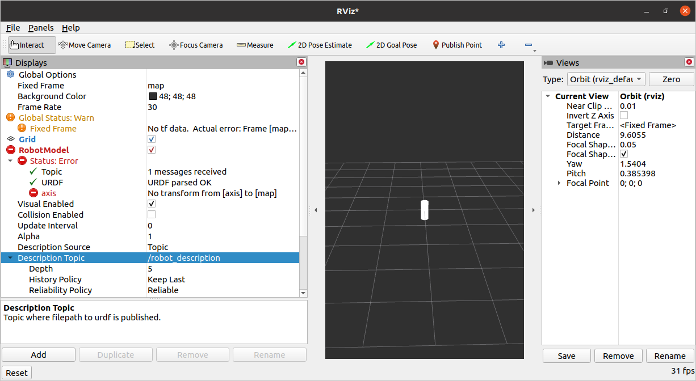
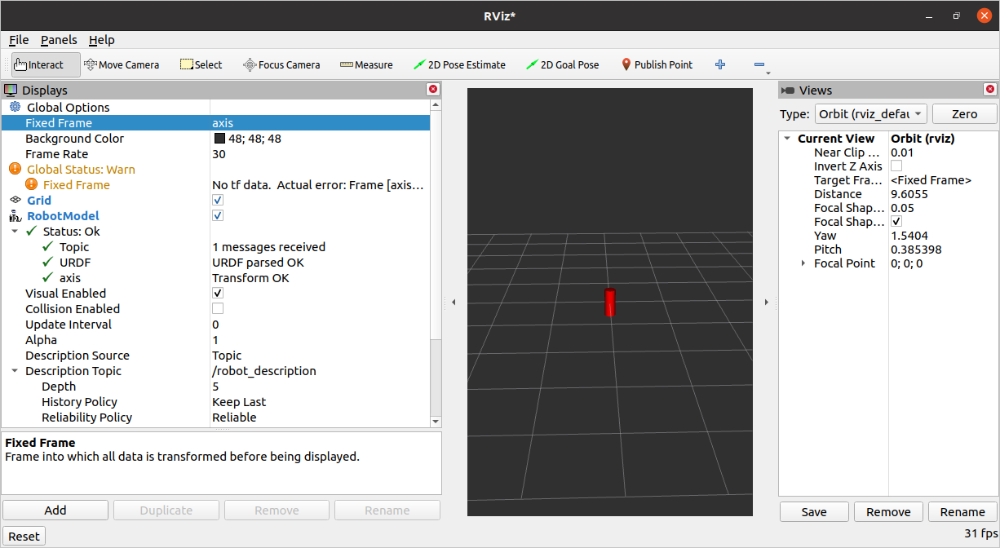
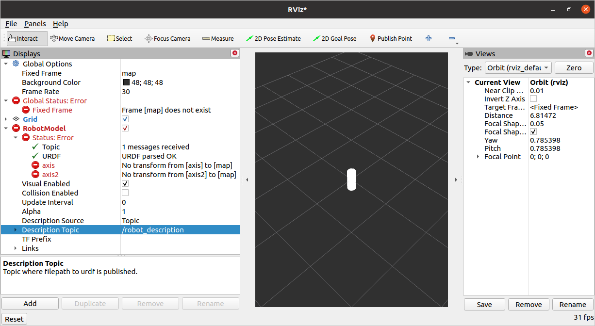
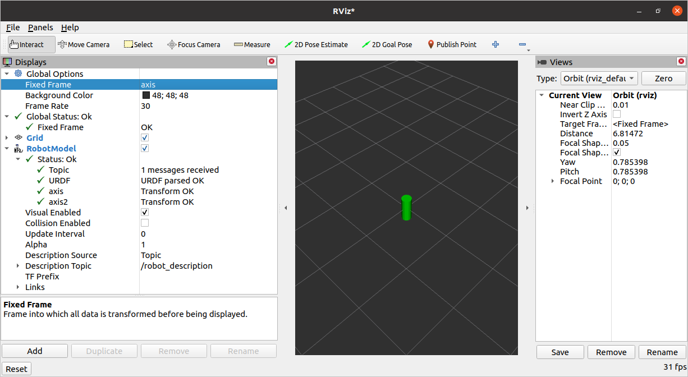
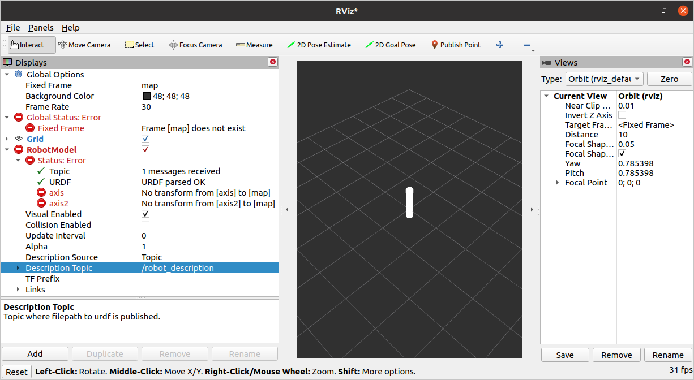
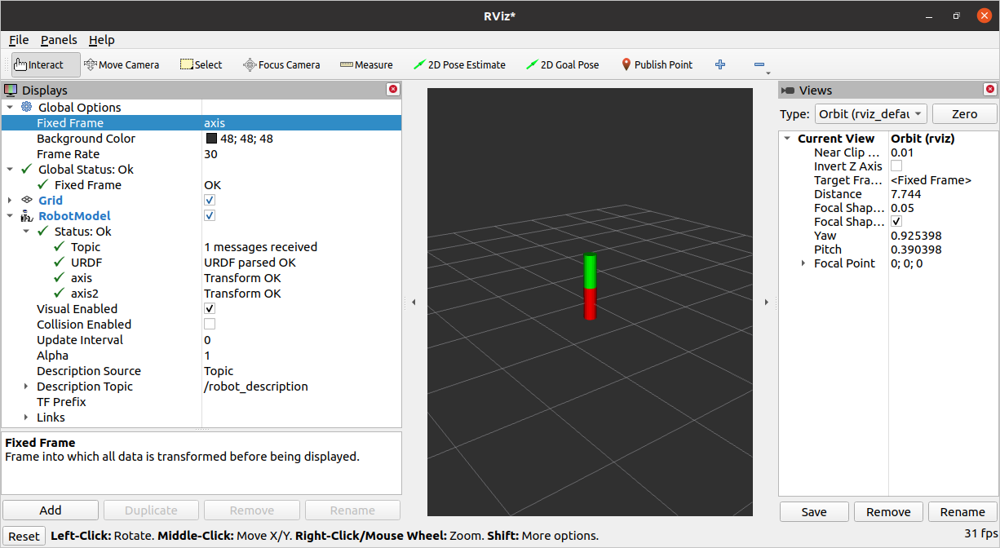
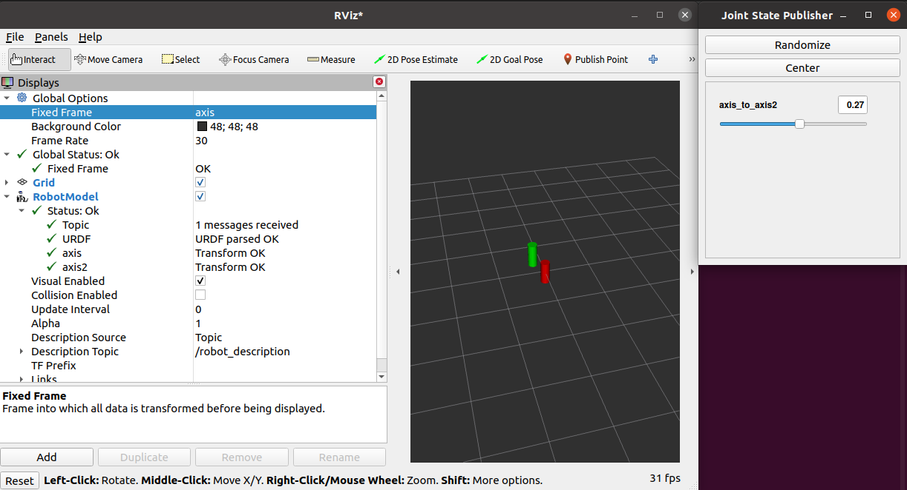
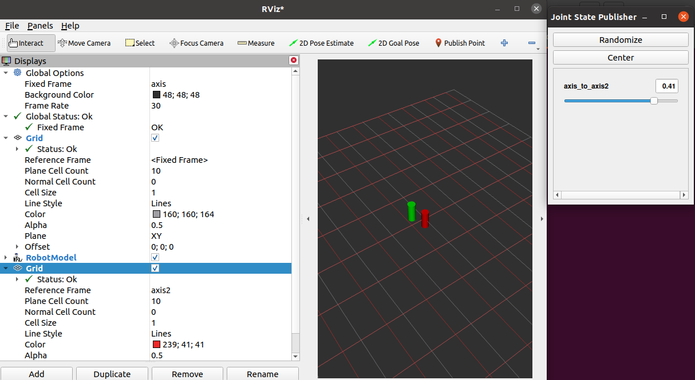

# Playing with URDF

## Infos

https://docs.ros.org/en/galactic/Tutorials/URDF/Using-URDF-with-Robot-State-Publisher.html

## Create Package

```
cd ~/dev_ws/src
ros2 pkg create playing_with_urdf --build-type ament_python --dependencies rclpy
cd playing_with_urdf
```

## Create local git repo

```
git init
git add .
```

## Import local git repo to eclipse as Project

check other tutorial

## Create urdf directory

Create directory named "urdf"

## Create urdf file

Inside this folder we create a file called x.urdf.xml. Where "x" could be everything.
E.g. call it myRobot.urdf.xml .

Write inside this

```
<robot name="myRobot">
      <link name="axis">
         <visual>
            <origin xyz="0 0 0" rpy="0 0 0"/>
            <geometry>
               <cylinder radius="0.1" length=".5"/>
            </geometry>
            <material name="red">
               <color rgba="1 0 0 1"/>
            </material>
         </visual>
      </link>
   </robot>
```

## Create launch directory

Create directory named "launch"

## Create launch file

Create inside "launch" directory, the file demo.launch.py and add this.

```
import os
   from ament_index_python.packages import get_package_share_directory
   from launch import LaunchDescription
   from launch.actions import DeclareLaunchArgument
   from launch.substitutions import LaunchConfiguration
   from launch_ros.actions import Node
   
   def generate_launch_description():
   
       use_sim_time = LaunchConfiguration('use_sim_time', default='false')
   
       urdf_file_name = 'myRobot.urdf.xml'
       urdf = os.path.join(
           get_package_share_directory('playing_with_urdf'),
           urdf_file_name )
       with open(urdf, 'r') as infp:
           robot_desc = infp.read()
   
       return LaunchDescription([
           DeclareLaunchArgument(
               'use_sim_time',
               default_value='false',
               description='Use simulation (Gazebo) clock if true'),
           Node(
               package='robot_state_publisher',
               executable='robot_state_publisher',
               name='robot_state_publisher',
               output='screen',
               parameters=[{'use_sim_time': use_sim_time, 'robot_description': robot_desc}],
               arguments=[urdf]),
       ])
```

## Edit setup.py

```
import os
   from glob import glob
   from setuptools import setup
   from setuptools import find_packages
   
   package_name = 'playing_with_urdf'
   
   setup(
       name=package_name,
       version='0.0.0',
       packages=[package_name],
       data_files=[
           ('share/ament_index/resource_index/packages',
               ['resource/' + package_name]),
           ('share/' + package_name, ['package.xml']),
            (os.path.join('share', package_name), glob('launch/*.py')),
            (os.path.join('share', package_name), glob('urdf/*'))
       ],
       install_requires=['setuptools'],
       zip_safe=True,
       maintainer='ros2',
       maintainer_email='inflo@web.de',
       description='TODO: Package description',
       license='TODO: License declaration',
       tests_require=['pytest'],
       entry_points={
           'console_scripts': [
           ],
       },
   )
```

## Build it, run it and watch with rviz2

```
colcon build
ros2 launch playing_with_urdf demo.launch.py
```


In another terminal (source install/setup.sh) run "rviz2". Then inside rviz2 add a
new Display (Ctrl + n) of type "RobotModel". Then in the Displays Panel we add the
"Description Topic" of the RobotModel, "/robot_description". 

Now we can see our robot and we see that it got no transform from axis to map. Also
our robot is colored white, but in urdf file we said it should be red. Thats because of
the transform error.



If we set the "Fixed Frame" of the Global Options Panel to "axis", then we need no
transform, because we are "axis".




## Lets add another link to our robot

Inside myRobot.urdf.xml we add another link and give it the green color.

```
<robot name="myRobot">
      <link name="axis">
         <visual>
            <origin xyz="0 0 0" rpy="0 0 0"/>
            <geometry>
               <cylinder radius="0.1" length=".5"/>
            </geometry>
            <material name="red">
               <color rgba="1 0 0 1"/>
            </material>
         </visual>
      </link>
      
      <link name="axis2">
         <visual>
            <origin xyz="0 0 0" rpy="0 0 0"/>
            <geometry>
               <cylinder radius="0.1" length=".5"/>
            </geometry>
            <material name="green">
               <color rgba="0 1 0 1"/>
            </material>
         </visual>
      </link>
      
      <joint name="axis_to_axis2" type="fixed">
         <parent link="axis"/>
         <child link="axis2"/>
      </joint>
   </robot>
```
   
We need a joint, which tells which one is the root_link. The first parent is the root link.

## Build, run, watch

```
colcon build
ros2 launch playing_with_urdf demo.launch.py
rviz2
```

We add the RobotModel Display and there the topic "/robot_description" to see our robot.



When we set the Global Options Fixed Frame to our own axis, our robot gets colored. But
we see only one color, that is because we have placed both links exactly at the same position.




## Change robot link position in urdf file

We change the origin of the axis2 link.

```
<robot name="myRobot">
      <link name="axis">
         <visual>
            <origin xyz="0 0 0" rpy="0 0 0"/>
            <geometry>
               <cylinder radius="0.1" length=".5"/>
            </geometry>
            <material name="red">
               <color rgba="1 0 0 1"/>
            </material>
         </visual>
      </link>
      
      <link name="axis2">
         <visual>
            <origin xyz="0 0 0.5" rpy="0 0 0"/>
            <geometry>
               <cylinder radius="0.1" length=".5"/>
            </geometry>
            <material name="green">
               <color rgba="0 1 0 1"/>
            </material>
         </visual>
      </link>
      
      <joint name="axis_to_axis2" type="fixed">
         <parent link="axis"/>
         <child link="axis2"/>
      </joint>
   </robot>

```

## Build , run , watch

```
colcon build
ros2 launch playing_with_urdf demo.launch.py
rviz2
```

We add RobotModel Display and set topic to /robot_description. We only see one link
of our robot and the transform errors.



Set Global Options Fixed Frame to our axis and we see both of our robot links. red and green.  




## Make the joint a prismatic one

We change the type of the fixed joint to prismatic. At http://wiki.ros.org/urdf/XML/joint
we see that a prismatic joint requires a <limit>

```
<robot name="myRobot">
      <link name="axis">
         <visual>
            <origin xyz="0 0 0" rpy="0 0 0"/>
            <geometry>
               <cylinder radius="0.1" length=".5"/>
            </geometry>
            <material name="red">
               <color rgba="1 0 0 1"/>
            </material>
         </visual>
      </link>
      
      <link name="axis2">
         <visual>
            <origin xyz="0 0 0.5" rpy="0 0 0"/>
            <geometry>
               <cylinder radius="0.1" length=".5"/>
            </geometry>
            <material name="green">
               <color rgba="0 1 0 1"/>
            </material>
         </visual>
      </link>
      
      <joint name="axis_to_axis2" type="prismatic">
         <parent link="axis"/>
         <child link="axis2"/>
         <limit lower="0" upper="0.5" effort="1" velocity="1"/> 
      </joint>
   </robot>
```

## Build, run, watch, move with joint_state_publisher_gui

```
colcon build
ros2 launch playing_with_urdf demo.launch.py
rviz2
ros2 run joint_state_publisher_gui joint_state_publisher_gui
```

We add the RobotModel Display and the topic /robot_description. Set Global Options Fixed
Frame to "axis". Then we move in the joint_state_publisher_gui the slider and see that
the green link is moving along the limits we setup in the urdf file.

It is moving along the x-axis, because in urdf file we have not set the <axis> option,
and it defaults to x-axis.



If we add a second "Grid Display" and set the "Reference Frame" of the Grid to "axis2" and
the color to red. We can see the grid moving with the link as we move the joint. The first grid
is referenced to <Fixed Frame> which is axis.




## Add floating joint

```
<robot name="myRobot">
      <link name="axis">
         <visual>
            <origin xyz="0 0 0" rpy="0 0 0"/>
            <geometry>
               <cylinder radius="0.1" length=".5"/>
            </geometry>
            <material name="red">
               <color rgba="1 0 0 1"/>
            </material>
         </visual>
      </link>
      
      <link name="axis2">
         <visual>
            <origin xyz="0 0 0.5" rpy="0 0 0"/>
            <geometry>
               <cylinder radius="0.1" length=".5"/>
            </geometry>
            <material name="green">
               <color rgba="0 1 0 1"/>
            </material>
         </visual>
      </link>
      
      <joint name="axis_to_axis2" type="floating">
         <origin xyz="0 0 .5" rpy="0 0 0"/>
         <parent link="axis"/>
         <child link="axis2"/>
         <limit lower="0" upper="0.5" effort="1" velocity="1"/> 
         <calibration rising="0.0"/>
            <dynamics damping="0.0" friction="0.0"/>
         <safety_controller k_velocity="10" k_position="15" soft_lower_limit="-2.0" soft_upper_limit="0.5" />
      </joint>
   </robot>
```

## Build, run, watch, use static_transform_publisher

```
colcon build
ros2 launch playing_with_urdf demo.launch.py
rviz2
ros2 run tf2_ros static_transform_publisher 1 0 0 0 0 0 1 axis axis2
```

First in rviz2 we would see the transform errors in our RobotModel. If we publish a transform
with 

```
ros2 run tf2_ros static_transform_publisher 1 0 0 0 0 0 1 axis axis2
```

 we see in rviz2, that one link has moved and the transforms are OK.


