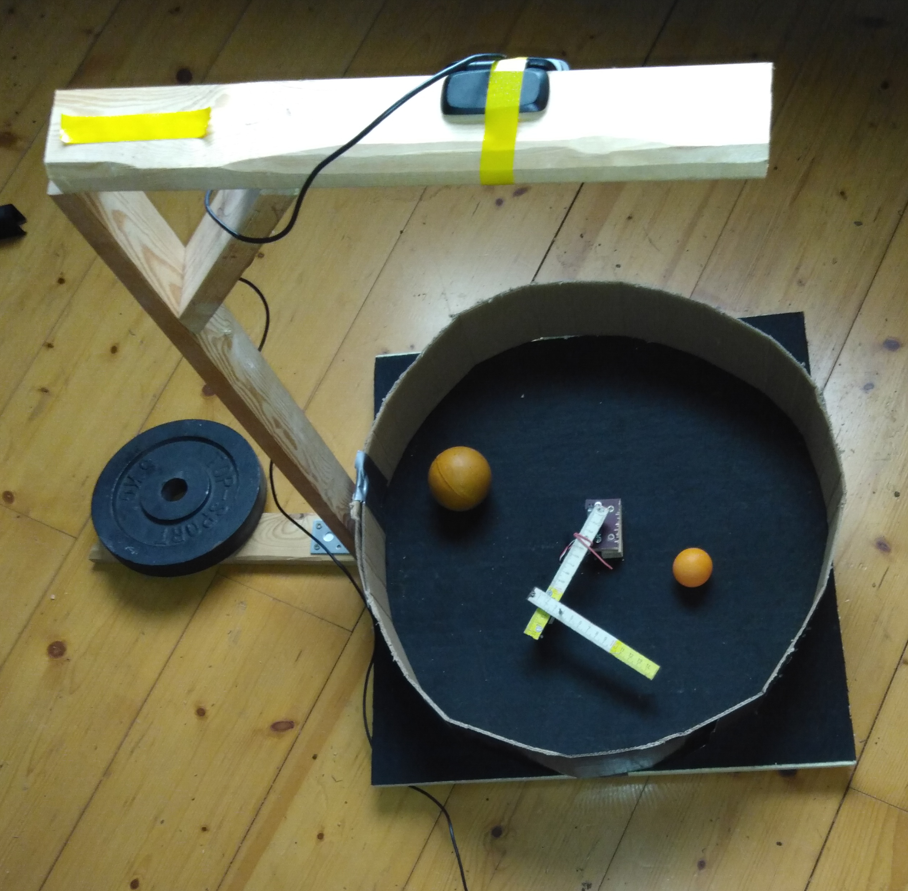

# Sim to real

## Info

Training models in simulation and test it in real world gym.

Build a sim-to-real-arena. The openAI-gym reacher is a good first try.

## Sim-to-real gym

## Select a simulator

I select google brax , but could be everything.

## Build the sim-to-real gym as a brax environment

