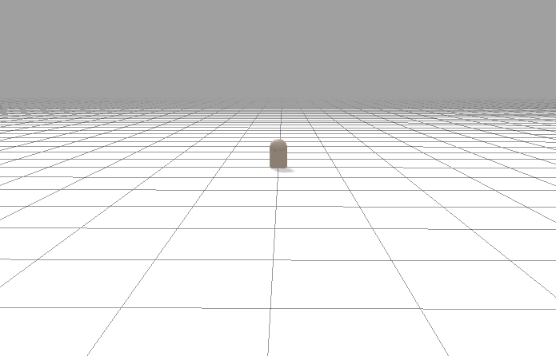
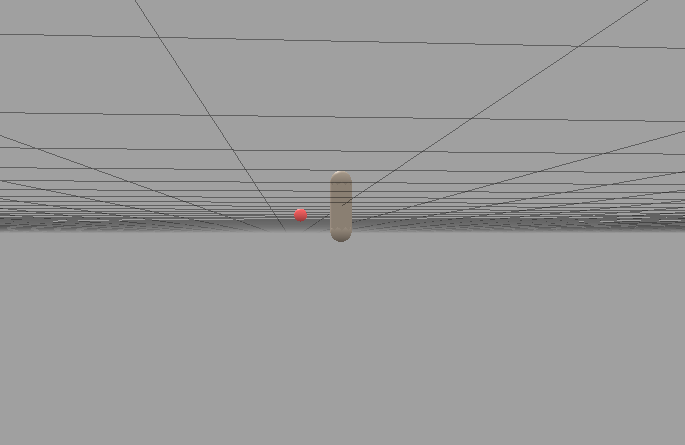

# google brax bodies


## A capsule

```
from typing import Tuple

import dataclasses
import jax
import jax.numpy as jnp
import brax
from brax.envs import env
from brax.physics import math
from brax.physics.base import take

from google.protobuf import text_format

###############
from IPython.display import HTML, IFrame, display, clear_output 

#brax_url = "https://github.com/google/brax.git@main"
#!pip install git+$brax_url
#clear_output()

from datetime import datetime
import functools
from jax.tools import colab_tpu
import matplotlib.pyplot as plt
import os
from brax.training import ppo, sac
from brax.io import html

# configure jax to run on tpu:
#colab_tpu.setup_tpu()


_SYSTEM_CONFIG = """
bodies {
  name: "Ground"
  colliders {
    plane {
    }
  }
  inertia {
    x: 1.0
    y: 1.0
    z: 1.0
  }
  mass: 1.0
  frozen { all: true }
}

bodies {
  name: "body_capsule"
  colliders {
    capsule {
      radius: .15
      length: 1.0
    }
    position { 
        x: .00
        z: .0
    }
  }
  inertia {
    x: 1.0
    y: 1.0
    z: 1.0
  }
  mass: 1.0
}

bodies {
  name: "target"
  colliders {
    position {
    }
    sphere {
      radius: 0.09
    }
  }
  inertia {
    x: 1.0
    y: 1.0
    z: 1.0
  }
  mass: 1.0
}

joints {
  name: "joint_ground"
  stiffness: 100.0
  parent: "Ground"
  child: "body_capsule"
  parent_offset {
    z: 0.0
  }
  child_offset {
      z: 0.0
  }
  rotation {
    y: 0.0
  }

  angle_limit {
      min: -360
      max: 360
  }


  limit_strength: 0.0
}


dt: 0.02
substeps: 4

"""


class Steelwire(env.Env):
  """Steelwire trains an agent to contact an object.

  Steelwire observes three bodies: 'Hand', 'Object', and 'Target'.
  When Object reaches Target, the agent is rewarded.
  """

  def __init__(self, **kwargs):
    config = text_format.Parse(_SYSTEM_CONFIG, brax.Config())
    super().__init__(config, **kwargs)
    self.object_idx = self.sys.body_idx['Ground']
    self.target_idx = self.sys.body_idx['target']
    # self.steelwire_end_idx = self.sys.body_idx['Object_0']
    #self.target_radius = .02
    # self.target_distance = .5

  def reset(self, rng: jnp.ndarray) -> env.State:
    qp = self.sys.default_qp()
    rng, target = self._random_target(rng)
    pos = jax.ops.index_update(qp.pos, jax.ops.index[self.target_idx], target)
    qp = dataclasses.replace(qp, pos=pos)
    info = self.sys.info(qp)
    obs = self._get_obs(qp, info)
    reward, done, steps, zero = jnp.zeros(4)
    metrics = {
        'hits': zero
    }
    return env.State(rng, qp, info, obs, reward, done, steps, metrics)

  def step(self, state: env.State, action: jnp.ndarray) -> env.State: 
    rng = state.rng
    qp, info = self.sys.step(state.qp, action)
    obs = self._get_obs(qp, info)

    # vector from tip to target is last 3 entries of obs vector
    reward_dist = 4 #-jnp.linalg.norm(obs[-3:])
    reward_ctrl = 4 #-jnp.square(action).sum()
    reward = reward_dist + reward_ctrl

    steps = state.steps + self.action_repeat
    done = jnp.where(steps >= self.episode_length, 1.0, 0.0)
    # metrics = {
    #     'rewardDist': reward_dist,
    #     'rewardCtrl': reward_ctrl,
    # }
    metrics = {
        'hits': reward_dist
    }

    return env.State(rng, qp, info, obs, reward, done, steps, metrics)


    

  @property
  def action_size(self) -> int:
    return super().action_size + 3  # 3 extra actions for translating

  def _get_obs(self, qp: brax.QP, info: brax.Info) -> jnp.ndarray:
    """Egocentric observation of target and arm body."""

    # some pre-processing to pull joint angles and velocities
    (joint_angle,), _ = self.sys.joint_revolute.angle_vel(qp)

    # qpos:
    # x,y coord of target
    qpos = [qp.pos[self.target_idx, :2]]

    # dist to target and speed of tip
    arm_qps = take(qp, jnp.array(self.target_idx))
    tip_pos, tip_vel = math.to_world(arm_qps, jnp.array([0.11, 0., 0.]))
    tip_to_target = [tip_pos - qp.pos[self.target_idx]]
    cos_sin_angle = [jnp.cos(joint_angle), jnp.sin(joint_angle)]

    # qvel:
    # velocity of tip
    qvel = [tip_vel[:2]]

    return jnp.concatenate(cos_sin_angle + qpos + qvel + tip_to_target)

  def _random_target(self, rng: jnp.ndarray) -> Tuple[jnp.ndarray, jnp.ndarray]:
    """Returns new random target locations in a random circle on xz plane."""
    rng, rng1, rng2, rng3 = jax.random.split(rng, 4)
    # dist = self.target_radius + self.target_distance * jax.random.uniform(rng1)
    dist = 0.5 + 0.8 * jax.random.uniform(rng1)
    ang = jnp.pi * 2. * jax.random.uniform(rng2)
    target_x = dist * jnp.cos(ang)
    target_y = dist * jnp.sin(ang)
    target_z = 0.5 * jax.random.uniform(rng3)
    target = jnp.array([target_x, target_y, target_z]).transpose()
    return rng, target


config = text_format.Parse(_SYSTEM_CONFIG, brax.Config())

envf = Steelwire()
state = envf.reset(rng=jax.random.PRNGKey(seed=0))

def visualize(sys, qps):
  """Renders a 3D visualization of the environment."""
  return HTML(html.render(sys, qps))

visualize(envf.sys, [state.qp])

```

The above code in a colab notebook will give the following result



If we move with the mouse the plane, we see the target (red sphere) under the plane.




## What do we have ?

We have a plane, a capsule and a sphere. Why is the capsule located in the middle of the plane, not above ? It seemed that every body is placed at x=0, y=0, z=0. So they overlap.