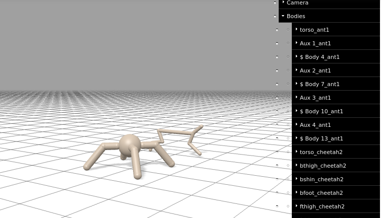

# google brax composer


## We create a notebook

We create in brax/notebook a notebook named e.g. composer-test.ipynb and open it with

```
jupyter notebook
```

## Create a composer env

Into the first code cell we put in 

```
#@title Colab setup and imports
#@markdown ## ⚠️ PLEASE NOTE:
#@markdown This colab runs best using a TPU runtime.  From the Colab menu, choose Runtime > Change Runtime Type, then select **'TPU'** in the dropdown.

from datetime import datetime
import functools
import os

from IPython.display import HTML, clear_output
import jax
import jax.numpy as jnp
import matplotlib.pyplot as plt

if 'COLAB_TPU_ADDR' in os.environ:
    try:
      import brax
    except ImportError:
      !pip install git+https://github.com/flobotics/brax.git@custom_envs
      clear_output()
      import brax
else:
    import brax

from brax import envs
from brax.training import ppo, sac
from brax.io import html
from brax.experimental.composer import composer

if 'COLAB_TPU_ADDR' in os.environ:
  from jax.tools import colab_tpu
  colab_tpu.setup_tpu()
```


The only difference to training.ipynb first code cell is

```
from brax.experimental.composer import composer
```

Create another code-cell and put in

```
composer1 = composer.Composer(
    components=dict(
        ant1=dict(component='ant', pos=(0, 1, 0)),
        ant2=dict(component='ant', pos=(0, -1, 0)),
    ),
    edges=dict(ant1__ant2=dict(collide_type='full'),),
   )
env = composer.ComponentEnv(composer=composer1)
```


Create new code-cell and put in

```
jit_env_reset = jax.jit(env.reset)
state = jit_env_reset(rng=jax.random.PRNGKey(seed=0))

def visualize(sys, qps):
  """Renders a 3D visualization of the environment."""
  return HTML(html.render(sys, qps))

visualize(env.sys, [state.qp])
```


The last cell visualizes the env which looks like 


## Create a composer env with composer.create_fn()

We create a new notebook file with

```
#@title Colab setup and imports
#@markdown ## ⚠️ PLEASE NOTE:
#@markdown This colab runs best using a TPU runtime.  From the Colab menu, choose Runtime > Change Runtime Type, then select **'TPU'** in the dropdown.

from datetime import datetime
import functools
import os

from IPython.display import HTML, clear_output
import jax
import jax.numpy as jnp
import matplotlib.pyplot as plt

if 'COLAB_TPU_ADDR' in os.environ:
    try:
      import brax
    except ImportError:
      !pip install git+https://github.com/flobotics/brax.git@custom_envs
      clear_output()
      import brax
else:
    import brax

from brax import envs
from brax.training import ppo, sac
from brax.io import html
from brax.experimental.composer import composer

if 'COLAB_TPU_ADDR' in os.environ:
  from jax.tools import colab_tpu
  colab_tpu.setup_tpu()
```


next code cell we put in

```
env_name = "ant_cheetah"
env_fn = composer.create_fn(env_name=env_name)
env = env_fn()
```

in next code cell we put in 

```
jit_env_reset = jax.jit(env.reset)
state = jit_env_reset(rng=jax.random.PRNGKey(seed=0))

def visualize(sys, qps):
  """Renders a 3D visualization of the environment."""
  return HTML(html.render(sys, qps))

visualize(env.sys, [state.qp])
```


If we run these cells it looks like




Then we add the training part

```


#@title Training some pre-included Brax environments

# We determined some reasonable hyperparameters offline and share them here.
train_fn = {
  'ant_cheetah': functools.partial(
      ppo.train, num_timesteps = 50000000, log_frequency = 20,
      reward_scaling = 10, episode_length = 1000, normalize_observations = True,
      action_repeat = 1, unroll_length = 5, num_minibatches = 32,
      num_update_epochs = 4, discounting = 0.95, learning_rate = 3e-4,
      entropy_cost = 1e-2, num_envs = 2048, batch_size = 1024
  ),
  'humanoid': functools.partial(
      sac.train, num_timesteps = 1048576 * 5,
      log_frequency = 131012, reward_scaling = 30, episode_length = 1000,
      normalize_observations = True, action_repeat = 1, discounting = 0.99,
      learning_rate = 6e-4, num_envs = 64, batch_size = 512,
      min_replay_size = 8192, max_replay_size = 1048576,
      grad_updates_per_step = 0.125, max_devices_per_host=4
  ),
  'fetch': functools.partial(
      ppo.train, num_timesteps = 100_000_000, log_frequency = 20,
      reward_scaling = 5, episode_length = 1000, normalize_observations = True,
      action_repeat = 1, unroll_length = 20, num_minibatches = 32,
      num_update_epochs = 4, discounting = 0.997, learning_rate = 3e-4,
      entropy_cost = 0.001, num_envs = 2048, batch_size = 256
  ),
  'grasp': functools.partial(
      ppo.train, num_timesteps = 600_000_000, log_frequency = 10,
      reward_scaling = 10, episode_length = 1000, normalize_observations = True,
      action_repeat = 1, unroll_length = 20, num_minibatches = 32,
      num_update_epochs = 2, discounting = 0.99, learning_rate = 3e-4,
      entropy_cost = 0.001, num_envs = 2048, batch_size = 256
  ),
  'halfcheetah': functools.partial(
      ppo.train, num_timesteps = 100_000_000, log_frequency = 10,
      reward_scaling = 1, episode_length = 1000, normalize_observations = True,
      action_repeat = 1, unroll_length = 20, num_minibatches = 32,
      num_update_epochs = 8, discounting = 0.95, learning_rate = 3e-4,
      entropy_cost = 0.001, num_envs = 2048, batch_size = 512
  ),
  'ur5e': functools.partial(
      ppo.train, num_timesteps = 20_000_000, log_frequency = 20,
      reward_scaling = 10, episode_length = 1000, normalize_observations = True,
      action_repeat = 1, unroll_length = 5, num_minibatches = 32,
      num_update_epochs = 4, discounting = 0.95, learning_rate = 2e-4,
      entropy_cost = 1e-2, num_envs = 2048, batch_size = 1024,
      max_devices_per_host = 8
  ),
  'reacher': functools.partial(
      ppo.train, num_timesteps = 100_000_000, log_frequency = 20,
      reward_scaling = 5, episode_length = 1000, normalize_observations = True,
      action_repeat = 4, unroll_length = 50, num_minibatches = 32,
      num_update_epochs = 8, discounting = 0.95, learning_rate = 3e-4,
      entropy_cost = 1e-3, num_envs = 2048, batch_size = 256,
      max_devices_per_host = 8, seed = 1),
  'testenv': functools.partial(
      ppo.train, num_timesteps = 100_000_000, log_frequency = 20,
      reward_scaling = 5, episode_length = 1000, normalize_observations = True,
      action_repeat = 1, unroll_length = 20, num_minibatches = 32,
      num_update_epochs = 4, discounting = 0.997, learning_rate = 3e-4,
      entropy_cost = 0.001, num_envs = 2048, batch_size = 256
  ),
  'testenv2': functools.partial(
      ppo.train, num_timesteps = 100_000_000, log_frequency = 20,
      reward_scaling = 5, episode_length = 1000, normalize_observations = True,
      action_repeat = 1, unroll_length = 20, num_minibatches = 32,
      num_update_epochs = 4, discounting = 0.997, learning_rate = 3e-4,
      entropy_cost = 0.001, num_envs = 2048, batch_size = 256
  ),
}[env_name]
max_y = {'ant_cheetah': 6000, 
         'humanoid': 12000, 
         'fetch': 15, 
         'grasp': 100, 
         'halfcheetah': 8000,
         'ur5e': 10,
         'reacher': 5,
         'testenv': 15000,
         'testenv2': 15000}[env_name]

min_y = {'reacher': -100}.get(env_name, 0)
min_y = {'testenv': -10000}.get(env_name, 0)
min_y = {'testenv2': -10000}.get(env_name, 0)

xdata = []
ydata = []
times = [datetime.now()]

def progress(num_steps, metrics):
  times.append(datetime.now())
  xdata.append(num_steps)
  ydata.append(metrics['eval/episode_reward'])
  clear_output(wait=True)
  plt.xlim([0, train_fn.keywords['num_timesteps']])
  plt.ylim([min_y, max_y])
  plt.xlabel('# environment steps')
  plt.ylabel('reward per episode')
  plt.plot(xdata, ydata)
  plt.show()

inference_fn, params, _ = train_fn(environment_fn=env_fn, progress_fn=progress)

print(f'time to jit: {times[1] - times[0]}')
print(f'time to train: {times[-1] - times[1]}')
```

and then the visualization part

```
#@title Visualizing a trajectory of the learned inference function

jit_env_step = jax.jit(env.step)
jit_inference_fn = jax.jit(inference_fn)
rng = jax.random.PRNGKey(seed=0)
reset_key, rng = jax.random.split(rng)
state = jit_env_reset(rng=reset_key)
qps = []
while not state.done:
  qps.append(state.qp)
  tmp_key, rng = jax.random.split(rng)
  act = jit_inference_fn(params, state.obs, tmp_key)
  state = jit_env_step(state, act)

visualize(env.sys, qps)
```

But till now we see only a grey-image as trajectory.
