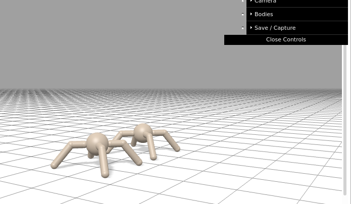

# google brax composer


## We create a notebook

We create in brax/notebook a notebook named e.g. composer-test.ipynb and open it with

```
jupyter notebook
```

Into the first code cell we put in 

```
#@title Colab setup and imports
#@markdown ## ⚠️ PLEASE NOTE:
#@markdown This colab runs best using a TPU runtime.  From the Colab menu, choose Runtime > Change Runtime Type, then select **'TPU'** in the dropdown.

from datetime import datetime
import functools
import os

from IPython.display import HTML, clear_output
import jax
import jax.numpy as jnp
import matplotlib.pyplot as plt

if 'COLAB_TPU_ADDR' in os.environ:
    try:
      import brax
    except ImportError:
      !pip install git+https://github.com/flobotics/brax.git@custom_envs
      clear_output()
      import brax
else:
    import brax

from brax import envs
from brax.training import ppo, sac
from brax.io import html
from brax.experimental.composer import composer

if 'COLAB_TPU_ADDR' in os.environ:
  from jax.tools import colab_tpu
  colab_tpu.setup_tpu()
```


The only difference to training.ipynb first code cell is

```
from brax.experimental.composer import composer
```

Create another code-cell and put in

```
composer1 = composer.Composer(
    components=dict(
        ant1=dict(component='ant', pos=(0, 1, 0)),
        ant2=dict(component='ant', pos=(0, -1, 0)),
    ),
    edges=dict(ant1__ant2=dict(collide_type='full'),),
   )
env = composer.ComponentEnv(composer=composer1)
```


Create new code-cell and put in

```
jit_env_reset = jax.jit(env.reset)
state = jit_env_reset(rng=jax.random.PRNGKey(seed=0))

def visualize(sys, qps):
  """Renders a 3D visualization of the environment."""
  return HTML(html.render(sys, qps))

visualize(env.sys, [state.qp])
```


The last cell visualizes the env which looks like 

